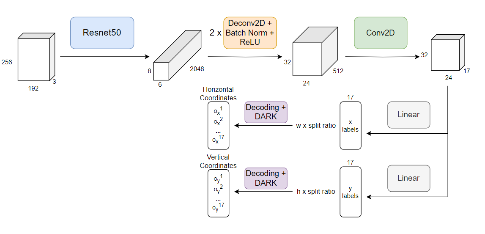
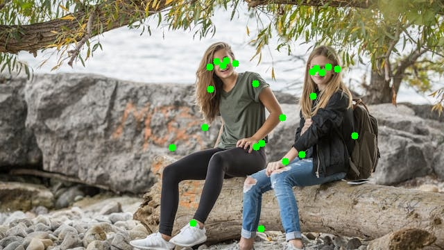
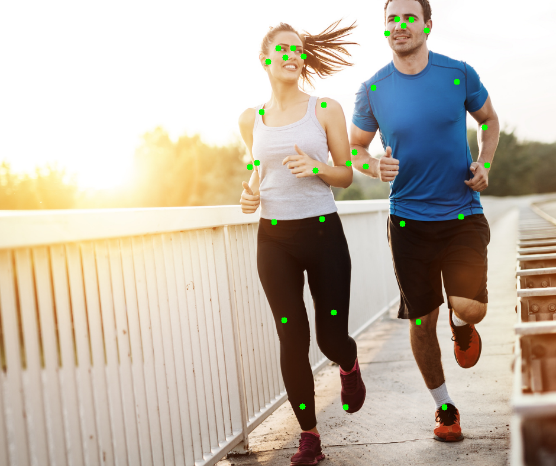

# Pose Estimation Model 

### Description
Application for experimenting in training pose estimation model using SimCC architecture and DARK refinement.

## Prerequisites
- [PyTorch](https://pytorch.org/)
- [OpenCV](https://opencv.org/releases/) (both C++ and Python)
- [CMake](https://cmake.org/download/)
- Visual Studio C++ Compiler

## Model Architecture
- Pose Model uses resnet50 as backbone, a few transpose convolution (deconvolution) layers to upscale the feature maps and finally go through SimCC head (linear classifiers) to produce x (horizontal) and y (vertical) labels.

- Then the predicted labels go through a decoding process which utilizes DARK refinement to produce the final joints coordinates.
- A diagram of the model archirecture with the configurations I used

- According to SimCC paper, we split each pixel into multiple bins (horizontally and vertically) using the splitting factor and set as >= 1 to reduce quantization error, resulting in sub-pixel localization precision. This means that the encoded labels from the dataset will be of length W * k or H * k (k is split ratio).
- The encoding and decoding methods are based on Gaussian distribution assumption for both x and y labels.
- One may feel free to adjust the configurations for the model architecture (number of deconv layers, split ratio, sigma for gaussian distribution, even the backbone, ...) for experiments.

## Demo
- A few demo images of pose estimation using my trained model.

- A demo for real time pose estimation using cuda C++ code.

https://github.com/user-attachments/assets/1301cbf8-3757-47e5-a573-f8595614d2e3

